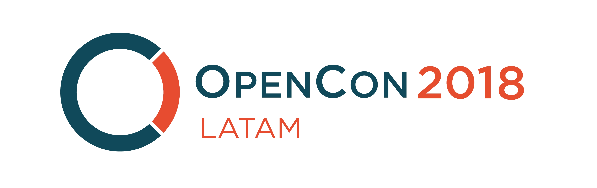
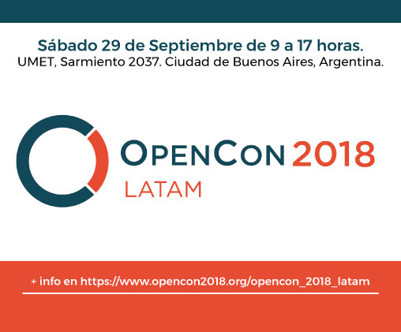

*[Spanish version](español.md)*

[OpenCon](https://www.opencon2018.org) is the international conference on open access to scientific and academic knowledge, open education and open data organised by the [Right to Research Coalition](http://righttoresearch.org/), [SPARC](https://sparcopen.org) (The Scholarly Publishing and Academic Resources Coalition) and young academic professionals from different parts of the world.

[OpenCon LatAm](https://www.opencon2018.org/opencon_2018_latam) is one of the 25 satellite events of the global conference, where we tackle regional problems and challenges in open access, open education and open data that matter to us. It had its first edition in Mexico City in 2017 and this year it will take place in Buenos Aires, Argentina.

[Check the event program here](http://opencon2018latama.sched.com/)

*OpenCon is more than a conference: It’s a platform for the next generation to learn about Open Access, Open Education, and Open Data, develop critical skills, and catalyze action toward a more open system for sharing the world’s information—from scholarly and scientific research, to educational materials, to digital research data.*

## We need your help to make OpenCon Latam 2018 possible.

This event is possible thanks to the contribution of institutions and people who value the benefits of training the next generation of researchers and education professionals within the open culture.

We aim to raise 2000USD that we will use to cover:

- Accomodation costs for speakers
- Travelling costs for speakers
- Coffee breaks
- Stationery

**Your contribution helps keeping active the long tradition of openness and democratization of science and education in our region!**

#### Organizers
OpenCon LatAM (Local & Regional)    
Right to Research Coalition    
SPARC (The Scholarly Publishing and Academic Resources Coalition)    

#### Contact: [openconlatam@gmail.com](mailto:openconlatam@gmail.com)

#### More information in [www.opencon2018.org/opencon_2018_latam](www.opencon2018.org/opencon_2018_latam)
